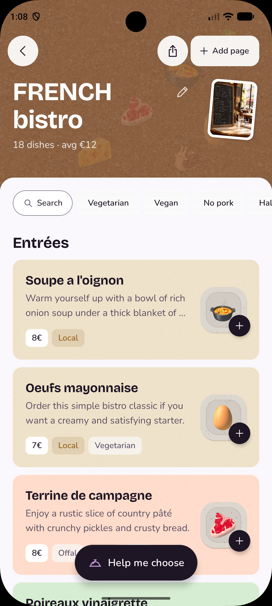
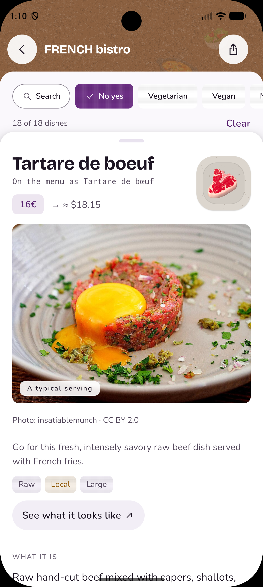
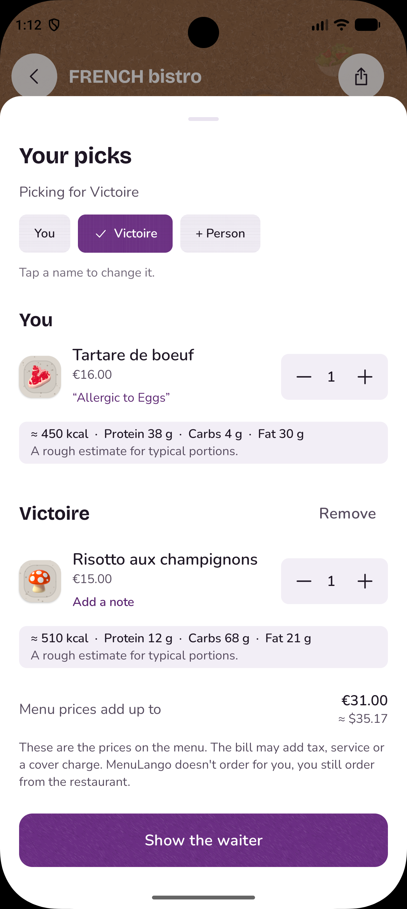
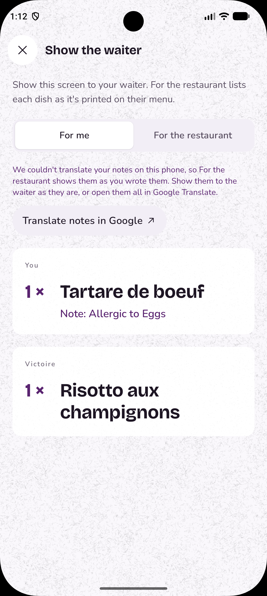

# MenuLango

**Photograph a menu abroad. Understand every dish. Order the one you'd never have dared to.**

MenuLango reads a restaurant menu from a single photo and explains every dish — what it is, what's in it, and how it's cooked — then helps you choose: something new, something special, something you can only eat here, or something simple for a tired evening.

Kotlin Multiplatform · Compose Multiplatform · Android and iOS from one codebase · [MIT licensed](LICENSE)

| Menu | Dish | Your picks | Show the waiter |
|---|---|---|---|
|  |  |  |  |

---

## Features

### Reading a menu
- **One photo, any language**, printed or handwritten, from the camera or the photo library.
- **Menus with several pages**: add pages while the first is still being read. A page that is the exact same photo as one already added is skipped, with a note, so it never costs a scan.
- **Dishes stream in** one by one while the menu is being read.
- **The restaurant's name** is read from the menu when it is printed there, never guessed, and can be renamed.
- **A menu scanned again is free.** Menus are recognised by the dish names printed on them, not by the photo.
- **A sample menu** (a Greek taverna) for trying the app without a camera.

### Understanding a dish
- **What it is**, in plain words, and **how it is made**: the method, the time, the heat.
- **Ingredients** and **allergens**, split into "likely contains" and "may contain".
- **A rough nutrition estimate** for one plate: calories, protein, carbohydrates and fat.
- **A typical photo** from Wikipedia and Wikimedia Commons, credited to its photographer, and a button for more photos on Google Images. The app asks which dishes have a photo as soon as a menu is read, so a placeholder only appears when a photo is coming.
- **Adventure level** (1–5), **effort level** (1–5) and flags such as spicy, raw, offal, vegetarian, vegan, good for sharing and local speciality.
- **"Don't leave without trying"**: the local specialities, at the bottom of the menu.
- **At a glance**: each menu's header shows its number of dishes and its average price.

### Narrowing it down
- **Filters**: vegetarian, vegan, no pork, halal-friendly, kosher-friendly, no offal, nothing raw, not spicy, good for sharing, local specialities, and a budget filter at or below the menu's middle price. A filter only appears when it would change that menu.
- **Your own words to leave out** (such as "coriander"), set once in Settings and applied to every menu.
- **Dietary preferences** set once in Settings and applied to every menu as it opens.
- **Search** by name, and optionally by ingredients or description, and by price: "under 15", "10-25", "chicken under 20".
- **Hide a dish** by swiping it away (with undo). Hidden dishes, and those left out by your words, are listed separately.
- **Price conversion** (optional): every price shows a rough amount in your own currency, for 166 currencies, using daily rates.

### Choosing and ordering
- **Picks for the whole table**: add dishes for yourself and for each person at the table, with a quantity and a note on any dish ("no nuts, please").
- **Totals**: the bill, the bill in your own currency, and a rough nutrition estimate (calories, protein, carbohydrates, fat) for each person.
- **Show the waiter**: the order in the restaurant's language, with each dish as printed on the menu and notes translated on the phone. A switch flips between "For me" and "For the restaurant". If a note cannot be translated on the phone, one button opens the whole order in Google Translate.
- **Help me choose** (Plus): pick a mood (something new, something special, something you can only eat here, something simple) and swipe through suggested dishes, each with the reason it was chosen. On tall phones, the card also lists the ingredients when they fit.

### Keeping track
- **Menus**: every scanned menu is saved on the phone, with search (optionally inside the dishes), date filters (this week, this month, older) and swipe to delete.
- **What you picked here**: a journal of the dishes picked on each menu, with your own notes on them.
- **Eaten history** (Plus): mark dishes as eaten, so suggestions stay new to you.
- **Share a menu** (Plus): a link and QR code to the explained menu, which opens in any browser for 24 hours. Your photo, picks and notes are never included.
- **Encrypted backup**: export everything to a file protected by your own passphrase, and restore it on another phone.

### Payments
- **Free**: three menus a month, up to three pages each, with every dish fully explained. A scan is only counted once you have seen the dishes.
- **MenuLango Plus** (RevenueCat): a 7-day Trip Pass (weekly), monthly and yearly plans. Unlimited menus and pages, Help me choose, eaten history and sharing.
- **The paywall is driven by the current RevenueCat offering**, so plans, the highlighted plan and the headline (per language) are set from the dashboard, and Experiments and Targeting work.
- **Restore purchases** is always in Settings.

### Comfort
- **Nine app languages** (English, French, Spanish, Arabic, Chinese, Japanese, Korean, Russian, Hindi), chosen separately from the phone's language, with a right-to-left layout for Arabic. New menus are explained in the chosen language.
- **Light and dark**, following the phone or chosen in Settings.
- **Calm motion**: an in-app switch that turns animations down, on top of the phone's own reduce-motion setting.
- **Start on Menus or on the camera**, and one-time tips that can be reset in Settings.

### Switched off for this release
- **Pick together** (friends at one table sending picks to one phone over Nearby Connections / Multipeer Connectivity) only worked between phones of the same platform. It is behind `PICK_TOGETHER_ENABLED` and its Bluetooth and location permissions are removed until it returns as a join-by-code table.

---

## For judges: try it with real scanning

MenuLango has been submitted to the App Store and Google Play and is waiting for review.

**On iPhone,** the quickest way is our TestFlight beta. The link is in our Devpost submission. Install
the TestFlight app, open the link, and install MenuLango. Buying MenuLango Plus in TestFlight is a
free test purchase, so every feature can be tried without being charged.

**On Android,** build it from this repository. It takes about 20 minutes, most of it downloads, and
needs no accounts:

1. **Install [Android Studio](https://developer.android.com/studio)** and, when it asks, let it set
   up an emulator (a virtual phone). A real Android phone with USB debugging on works too.
2. **Get the code:** `git clone https://github.com/alajemba-vik/Menulango.git`, then in Android
   Studio choose **File → Open** and pick the `Menulango` folder. Wait for "Gradle sync" to finish.
3. **Connect it to the server.** Create a file called `secrets.properties` in the `Menulango`
   folder (next to `README.md`) with these two lines. The server address comes to you privately
   from the team:

   ```properties
   PROXY_URL=<the address we sent you>
   MENULANGO_BETA_TOOLS=true
   ```

   The second line switches on the tester tools: a **Free Plus** switch in Settings, so every paid
   feature can be tried without buying anything.
4. **Run it:** pick **androidApp** and your emulator or phone at the top, and press ▶.
5. **Scan a menu.** On a phone, point the camera at any menu. On the emulator, drag a photo of a
   menu from your computer onto the emulator window, then in the app tap the gallery button and
   choose it from **Downloads**. Menu photos found online work well.

Things worth trying: a menu in a language you can't read (a handwritten demo menu is in
[`docs/demo/handwritten-menu.html`](docs/demo/handwritten-menu.html)), the halal-friendly and
vegetarian filters, **Help me choose** on a long menu, adding a second page, price conversion in
Settings, picking dishes for a friend with a note, then **Show the waiter**, and dark mode.

**iPhone:** building for iOS needs a Mac with Xcode, a physical iPhone (the on-device translation
library doesn't run on Apple-silicon simulators) and a paid Apple developer account, so Android is
the practical way to try it from source. The app is the same on both.

---

## Build it

> **New to Android or Kotlin Multiplatform?** Start with [`docs/GETTING_STARTED.md`](docs/GETTING_STARTED.md): installing the tools, running the app, testing and sending changes, step by step.

You need JDK 17+, the Android SDK (platform 37), and — for iOS — Xcode 26 and CocoaPods on a Mac. Nothing else: without any keys the app builds and runs on a bundled sample menu.

```bash
git clone <this repo> && cd Menulango
./gradlew :androidApp:installDebug      # Android, on a connected device or emulator
cd iosApp && pod install && open iosApp.xcworkspace
# iOS: pick a connected iPhone and press Run
```

Open the generated `.xcworkspace`, not `iosApp.xcodeproj`. Waiter-note translation uses Google's on-device ML Kit models. Its iOS library supports physical iPhones but excludes Apple-silicon simulators, so test that flow on a device. The rest of the shared app remains covered by the iOS test target.

New users see a **Sample menu** button beside the shutter (a Greek taverna, streamed exactly like a real scan). With `MENULANGO_BETA_TOOLS=true` (or `BETA_TOOLS=YES` on iOS), Settings also gets a **Free Plus** switch that unlocks the paid screens without a purchase.

### Connect it to the real thing

Three values, all optional:

| Value | What it is | Android | iOS |
|---|---|---|---|
| `PROXY_URL` | Your deployed Worker, e.g. `https://menulango-proxy.you.workers.dev` | `secrets.properties` | `iosApp/Configuration/Secrets.xcconfig` |
| `REVENUECAT_ANDROID_KEY` | RevenueCat public SDK key (`goog_…`) | `secrets.properties` | — |
| `REVENUECAT_IOS_KEY` | RevenueCat public SDK key (`appl_…`) | — | `Secrets.xcconfig` |
| `REVENUECAT_TEST_KEY` | Optional RevenueCat Test Store key (`test_…`), used only by debug builds | `secrets.properties` | `Secrets.xcconfig` |

```properties
# secrets.properties (repository root, git-ignored)
PROXY_URL=https://menulango-proxy.you.workers.dev
REVENUECAT_ANDROID_KEY=goog_xxxxxxxx
```

For iOS copy `iosApp/Configuration/Secrets.xcconfig.example` to `Secrets.xcconfig`. xcconfig files treat `//` as a comment, so URLs are written `https:/$()/host` — the example shows how. Environment variables with the same names also work for Android (useful in CI).

### RevenueCat setup

MenuLango has no account or app sign-in. Create the `menulango_pro` entitlement in RevenueCat and
attach the same store products to it on Android and iOS. Create a current `default` offering with
the **Weekly**, **Monthly** and **Annual** packages. The app reads only that entitlement and offers
“Restore purchases” in Settings, so a store purchase can be recovered on a new device without
creating a MenuLango account.

**No local proxy?** `node proxy/scripts/mock-proxy.mjs` serves the sample menu over the same streaming contract, and can simulate failures (`MOCK_ERROR=RATE_LIMITED`, `MOCK_EMPTY=1`, `MOCK_CUT=1`). On the Android emulator run `adb reverse tcp:8787 tcp:8787` and set `PROXY_URL=http://localhost:8787` (cleartext to localhost is allowed in debug builds only).

### Deploy the proxy

```bash
cd proxy
npm install
npx wrangler login
npx wrangler secret put GEMINI_API_KEY
npx wrangler deploy
scripts/scan.sh https://menulango-proxy.<you>.workers.dev path/to/menu.jpg en-US
```

The Workers free plan (100,000 requests a day) covers this comfortably.

### Checks

```bash
./gradlew spotlessCheck                          # ktlint, zero warnings
./gradlew :composeApp:testAndroidHostTest        # shared tests on the JVM
./gradlew :composeApp:iosSimulatorArm64Test      # the same tests on iOS
cd proxy && npm test && npm run typecheck        # the Worker
```

Shipping to the stores — keys, products, signing, listings — is written up step by step in [`docs/SHIPPING.md`](docs/SHIPPING.md).

---

## How it works

```
 photo ──► resize 1536px, JPEG 80 ──► Worker ──► Gemini 3.5 Flash-Lite (one call, structured JSON, streamed)
                                        │
 dishes appear one by one ◄── stream scanner ◄── validator ◄──┘
                   │
                   └──► SQLDelight cache (keyed by what is printed, not by the pixels)
```

- **One model call reads and explains the menu.** The Worker sends the photo with a JSON schema (`responseSchema`), so the response is always parseable. It also records the menu language, which the app uses later for waiter notes.
- **Streaming.** The Worker unwraps Gemini's server-sent events and streams the raw JSON. [`MenuStreamScanner`](composeApp/src/commonMain/kotlin/com/menulango/data/menu/remote/MenuStreamScanner.kt) cuts each dish object out of the stream the moment it closes, so the first dish is on screen long before the last is written.
- **Untrusted output is validated at the boundary.** [`MenuResponseParser`](composeApp/src/commonMain/kotlin/com/menulango/data/menu/remote/MenuResponseParser.kt) checks every dish (required fields, confidence in 0..1, levels on the scale, non-negative prices). Release builds drop a bad dish and carry on; debug builds throw so a prompt regression is impossible to miss.
- **The four choosing modes run locally**, ranking dishes the model already described ([`DishChooser`](composeApp/src/commonMain/kotlin/com/menulango/feature/choose/DishChooser.kt)). A dish is only ever recommended with its reason.
- **The Worker does more than read menus.** It looks up dish photos on Wikipedia (`/photo`, cached 30 days), relays the images so the phone never contacts Wikimedia (`/photo/image`), serves daily exchange rates (`/rates`, cached 6 hours), stores shared menus for 24 hours (`/share`, `/m/<id>`), and serves the privacy policy (`/privacy`). It limits each device to 4 scans a minute and 30 an hour, and checks Firebase App Check tokens (`APP_CHECK=monitor` until the store builds are live, then `enforce`).
- **Waiter notes translate on the device.** When you choose “Show the waiter”, ML Kit translates each note into the menu's language and caches the result with that order. The “For me” and “For the restaurant” toggle is instant and makes no network request. If an offline model is unavailable, the app keeps the original note and asks the diner to say or show it instead.
- **Your cache stays on your device.** Scanned menus, picks and dining history work offline. A user can export a passphrase-encrypted backup and restore it on another device; MenuLango never receives the backup or the passphrase.
- **Purchases need no sign-in.** RevenueCat reads the Apple App Store or Google Play entitlement, and “Restore purchases” is always available in Settings.

### Layout

```
composeApp/src/commonMain/kotlin/com/menulango/
  App.kt, Navigation.kt       root and back stack
  di/                         Koin modules, AppConfig
  core/design/                every colour, type style, space and motion token
  core/ui/                    paper components (chips, buttons, shimmer, states)
  core/result/                AppResult, AppError
  data/menu/model/            Menu, Dish — imports nothing
  data/menu/remote/           proxy client, DTOs, stream scanner, validator
  data/menu/local/            SQLDelight cache
  data/backup/                AES-GCM encrypted, user-held backup files
  data/menu/MenuRepository.kt the only place network and cache meet
  data/billing/               BillingRepository — the only file that imports RevenueCat
  data/quota/                 three free scans a month
  data/currency/              exchange rates and currency codes
  data/photo/                 dish photos, with look-ahead
  data/marks/, data/history/  names, hidden dishes, picks journal, eaten history
  feature/                    home · capture · menu · menus · dish · choose · order · paywall · settings · share · table
  platform/                   the expect/actual layer: camera, photo picker, backup files, currency, sharing, feedback mail
proxy/                        Cloudflare Worker (TypeScript)
iosApp/                       thin SwiftUI shell
androidApp/                   thin Android shell
```

Every screen state is a sealed `Loading / Ready / Empty / Failed`; ViewModels expose exactly one `StateFlow<UiState>`; no composable touches a repository.

## Accessibility

- Interactive controls have a 48 dp minimum target on Android (the matching 44 pt target on iOS),
  clear labels, and logical Compose semantics. Decorative illustrations are hidden from screen
  readers; headings, dish cards, sheets and scan status carry useful semantics.
- Scan progress and errors use polite live announcements. The dish and menu sheets identify
  themselves as panes and expose a close action to assistive technology.
- The shared theme accepts the platform reduce-motion setting, and the in-app **Calm motion** switch
  adds to it. Navigation becomes fades; press effects, texture drift, haptic ticks, rotating search
  hints, chip and photo animations are turned off.
- Every swipe has an accessibility action: deleting a menu, hiding a dish, and keeping or passing
  in Help me choose (which also has visible Keep and Pass buttons).
- Filter results are announced ("7 of 20 dishes"), and selected filters show a tick as well as a
  colour change. Rotating search hints and decorative echoes are hidden from screen readers.
- Before every store release, check TalkBack and VoiceOver on a real phone plus the largest system
  text setting. Record any visual-token contrast or layout issue in `NOTES.md` rather than working
  around it with one-off colours or sizes.

---

## Privacy and cost

- The Gemini key lives only in the Worker's secrets. It is not in the app binary.
- Photos are sent to the Worker and Gemini only to read the menu; the Worker does not store them. Menus and their photos are cached on the device only.
- Waiter-note translation and backup encryption happen on the device. Backups are protected with AES-GCM and a passphrase-derived key, then shared through the device's own file-sharing sheet.
- There are no accounts, ads, analytics SDKs or third-party tracking. The privacy policy is served by the proxy at `/privacy`.
- The Gemini API is used on the paid tier: Google's terms require it for apps used in the EEA, Switzerland and the UK, and on it Google does not use requests to improve its products.
- The only data the Worker stores is a menu a user chooses to share: its explanations, without photo, picks or notes, deleted after 24 hours.
- The app never asks for location. A random install ID is sent with scans only for rate limiting.
- RevenueCat manages store entitlements, while Apple and Google process payments. The app does not receive payment details.

## Known limitations

- **The free-scan counter is local**, so reinstalling resets it. At a quarter of a cent a scan that is cheaper than a server-side quota.
- **Backups are user-held.** If a passphrase is lost, the encrypted backup cannot be recovered by MenuLango.
- **Location is not used, by choice**, so the cache key's geohash is empty.
- **Pick together is off** until it works across iPhone and Android (see Features).
- Allergen information is an estimate, always shown as "Often contains…" and always followed by "Ask the restaurant if you have an allergy." It is never behind the paywall.

## Licence

[MIT](LICENSE). Bricolage Grotesque, Nunito and Caveat are bundled under the SIL Open Font License ([`docs/licenses`](docs/licenses)).
