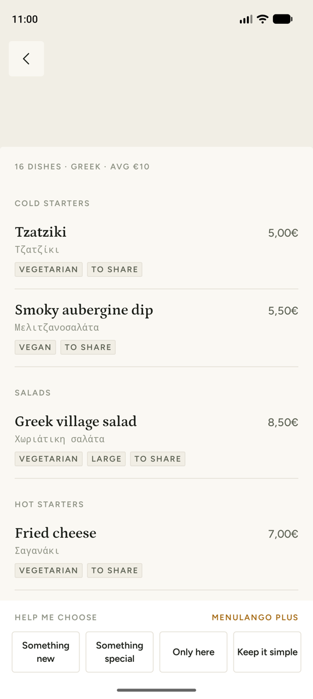
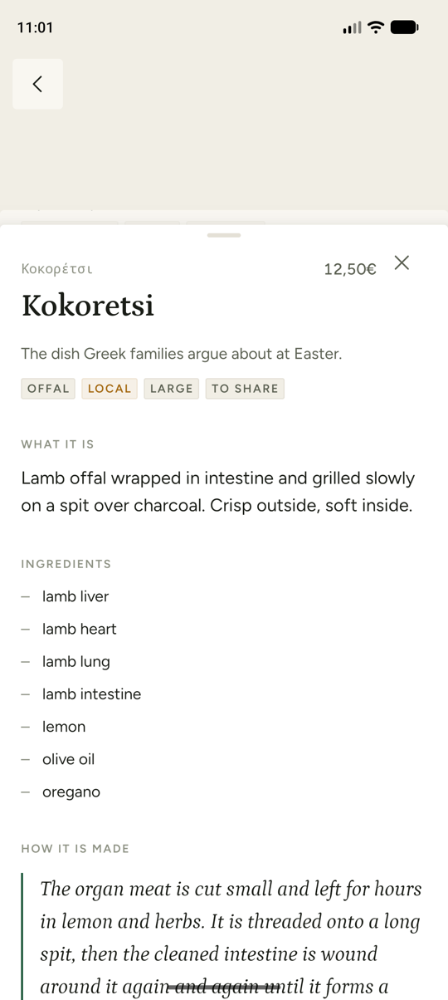
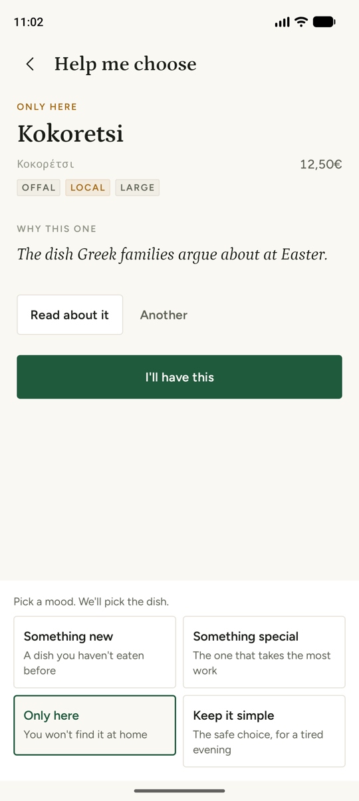
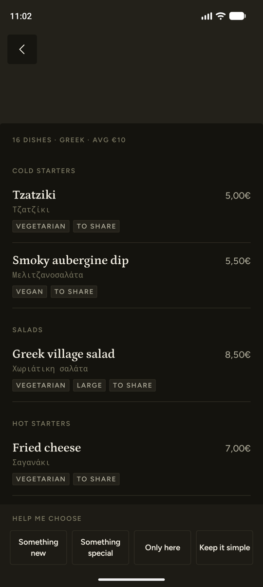

# MenuLango

**Photograph a menu abroad. Understand every dish. Order the one you'd never have dared to.**

MenuLango reads a restaurant menu from a single photo and explains every dish — what it is, what's in it, and how it's cooked — then helps you choose: something new, something special, something you can only eat here, or something simple for a tired evening.

Kotlin Multiplatform · Compose Multiplatform · Android and iOS from one codebase · [MIT licensed](LICENSE)

| Menu | Dish | Choose | Candlelight |
|---|---|---|---|
|  |  |  |  |

---

## Build it

> **New to Android or Kotlin Multiplatform?** Start with [`docs/GETTING_STARTED.md`](docs/GETTING_STARTED.md): installing the tools, running the app, testing and sending changes, step by step.

You need JDK 17+, the Android SDK (platform 37), and — for iOS — Xcode 26 on a Mac. Nothing else: without any keys the app builds and runs on a bundled sample menu.

```bash
git clone <this repo> && cd Menulango
./gradlew :androidApp:installDebug      # Android, on a connected device or emulator
open iosApp/iosApp.xcodeproj            # iOS: pick a simulator or device, press Run
```

In debug builds the capture screen has a **Sample menu** button (a Greek taverna, streamed exactly like a real scan) and a **Debug: Plus** toggle that unlocks the paid screens without a purchase.

### Connect it to the real thing

Three values, all optional:

| Value | What it is | Android | iOS |
|---|---|---|---|
| `PROXY_URL` | Your deployed Worker, e.g. `https://menulango-proxy.you.workers.dev` | `secrets.properties` | `iosApp/Configuration/Secrets.xcconfig` |
| `REVENUECAT_ANDROID_KEY` | RevenueCat public SDK key (`goog_…`) | `secrets.properties` | — |
| `REVENUECAT_IOS_KEY` | RevenueCat public SDK key (`appl_…`) | — | `Secrets.xcconfig` |

```properties
# secrets.properties (repository root, git-ignored)
PROXY_URL=https://menulango-proxy.you.workers.dev
REVENUECAT_ANDROID_KEY=goog_xxxxxxxx
```

For iOS copy `iosApp/Configuration/Secrets.xcconfig.example` to `Secrets.xcconfig`. xcconfig files treat `//` as a comment, so URLs are written `https:/$()/host` — the example shows how. Environment variables with the same names also work for Android (useful in CI).

**No local proxy?** `node proxy/scripts/mock-proxy.mjs` serves the sample menu over the same streaming contract, and can simulate failures (`MOCK_ERROR=RATE_LIMITED`, `MOCK_EMPTY=1`, `MOCK_CUT=1`). On the Android emulator run `adb reverse tcp:8787 tcp:8787` and set `PROXY_URL=http://localhost:8787` (cleartext to localhost is allowed in debug builds only).

### Deploy the proxy

```bash
cd proxy
npm install
npx wrangler login
npx wrangler secret put GEMINI_API_KEY      # a PAID-tier key — see "Privacy" below
npx wrangler deploy
scripts/scan.sh https://menulango-proxy.<you>.workers.dev path/to/menu.jpg en-US
```

The Workers free plan (100,000 requests a day) covers this comfortably.

### Checks

```bash
./gradlew spotlessCheck                          # ktlint, zero warnings
./gradlew :composeApp:testAndroidHostTest        # shared tests on the JVM
./gradlew :composeApp:iosSimulatorArm64Test      # the same tests on iOS
cd proxy && npm test && npm run typecheck        # the Worker
```

Shipping to the stores — keys, products, signing, listings — is written up step by step in [`docs/SHIPPING.md`](docs/SHIPPING.md).

---

## How it works

```
 photo ──► resize 1536px, JPEG 80 ──► Worker ──► Gemini 3.5 Flash-Lite (one call, structured JSON, streamed)
                                        │
 dishes appear one by one ◄── stream scanner ◄── validator ◄──┘
                   │
                   └──► SQLDelight cache (keyed by what is printed, not by the pixels)
```

- **One model call does OCR, translation and explanation.** No OCR library, no on-device model. The Worker sends the photo with a JSON schema (`responseSchema`), so the response is always parseable.
- **Streaming.** The Worker unwraps Gemini's server-sent events and streams the raw JSON. [`MenuStreamScanner`](composeApp/src/commonMain/kotlin/com/menulango/data/menu/remote/MenuStreamScanner.kt) cuts each dish object out of the stream the moment it closes, so the first dish is on screen long before the last is written.
- **Untrusted output is validated at the boundary.** [`MenuResponseParser`](composeApp/src/commonMain/kotlin/com/menulango/data/menu/remote/MenuResponseParser.kt) checks every dish (required fields, confidence in 0..1, levels on the scale, non-negative prices). Release builds drop a bad dish and carry on; debug builds throw so a prompt regression is impossible to miss.
- **The four choosing modes run locally**, ranking dishes the model already described ([`DishChooser`](composeApp/src/commonMain/kotlin/com/menulango/feature/choose/DishChooser.kt)). A dish is only ever recommended with its reason.
- **The cache key is the menu, not the photo.** Two photos of the same menu share no pixels but list the same dishes, so the key is a SHA-256 of the printed names (sorted, lowercased, accents folded) plus an optional coarse geohash ([`MenuCacheKey`](composeApp/src/commonMain/kotlin/com/menulango/data/menu/local/MenuCacheKey.kt)). Today it lets you reopen menus offline and makes rescanning a known menu free; the same key can move to the Worker's KV store so the second tourist at a taverna costs nothing.

### Layout

```
composeApp/src/commonMain/kotlin/com/menulango/
  App.kt, Navigation.kt       root, five-screen back stack
  di/                         Koin modules, AppConfig
  core/design/                every colour, type style, space and motion token
  core/ui/                    paper components (chips, buttons, shimmer, states)
  core/result/                AppResult, AppError
  data/menu/model/            Menu, Dish — imports nothing
  data/menu/remote/           proxy client, DTOs, stream scanner, validator
  data/menu/local/            SQLDelight cache, cache key
  data/menu/MenuRepository.kt the only place network and cache meet
  data/billing/               BillingRepository — the only file that imports RevenueCat
  data/quota/                 three free scans a month
  feature/                    capture · menu · dish · choose · paywall
  platform/ImageCapture.kt    the only expect/actual: camera capture and compression
proxy/                        Cloudflare Worker (TypeScript)
iosApp/                       thin SwiftUI shell
androidApp/                   thin Android shell
```

Every screen state is a sealed `Loading / Ready / Empty / Failed`; ViewModels expose exactly one `StateFlow<UiState>`; no composable touches a repository.

---

## Privacy and cost

- The Gemini key lives only in the Worker's secrets. It is not in the app binary.
- Use a **paid** Gemini API tier in production: on the free tier Google may use prompts and images to improve its models.
- Photos are not stored on the server. Menus and their photos are cached on the device only.
- No analytics SDK, no ads, no tracking. The privacy policy is served by the proxy at `/privacy`.
- A scan costs about a quarter of a US cent (≈1,700 input and ≈5,400 output tokens on Flash-Lite). The Worker logs tokens per scan; the app logs cache hits and parse failures.

## Known limitations

- **The free-scan counter is local**, so reinstalling resets it. At a quarter of a cent a scan that is cheaper than a server-side quota.
- **The cache is per device.** The key is built so it can move to the Worker's KV store; that is the next step.
- **Location is not used yet**, so the cache key's geohash is empty. Adding it needs a location permission and nothing else.
- Allergen information is an estimate, always shown as "Often contains…" and always followed by "Ask the restaurant if you have an allergy." It is never behind the paywall.

## Licence

[MIT](LICENSE). Petrona and Figtree are bundled under the SIL Open Font License ([`docs/licenses`](docs/licenses)).
